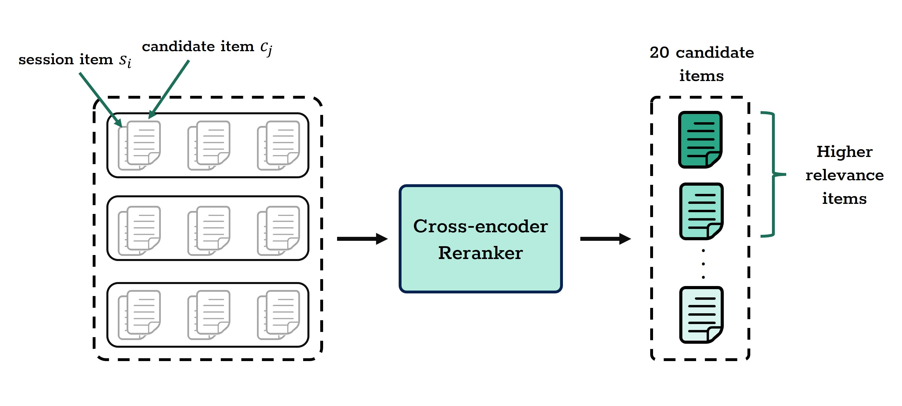

# LLMGreenRec: A Multi-Agent Recommender System for Sustainable E-Commerce

This repository contains the official implementation for the paper **"LLM-based Multi-Agent Recommender System for Sustainable E-Commerce"**. LLMGreenRec is a novel, two-stage framework designed to enhance sustainable product recommendations by leveraging a collaborative multi-agent system powered by Large Language Models..

## Architecture Overview

The overall architecture of LLMGreenRec is depicted below. The framework operates in a two-stage pipeline to provide accurate and relevant sustainable recommendations.


### Stage 1: Reranker Model (Candidate Filtering)
This stage uses a Cross-Encoder model to perform initial relevance filtering. It takes a large, randomly sampled candidate set (100 items) and narrows it down to a smaller, more relevant subset (20 items) based on the user's current session interactions. This step is handled by `process_candidate.py`.



### Stage 2: Multi-Agent Prompt Optimization
The core of our framework, this stage employs a collaborative system of six specialized LLM-based agents to find the optimal prompt for the recommendation task. The agents work in a closed-loop feedback cycle to identify ranking failures, infer their causes, and iteratively refine prompts. This process is orchestrated by `main.py` and the agent logic is defined in `agents.py`.


## Requirements

To run this project, you need Python 3.8+ and the following libraries. You can install them using pip:

```bash
pip install torch transformers python-dotenv tqdm wandb agno openai
```

- **PyTorch**: Ensure you have a version compatible with your CUDA toolkit for GPU acceleration.
- **`agno` & `opt`**: These appear to be custom modules. Ensure they are correctly placed in your project directory.

## Setup

1.  **Clone the Repository**
    ```bash
    git clone [https://github.com/your-username/LLMGreenRec.git](https://github.com/your-username/LLMGreenRec.git)
    cd LLMGreenRec
    ```

2.  **Set Up Environment Variables**
    * Rename the `.env.example` file to `.env` (or create a new `.env` file).
    * Open the `.env` file and add your DeepInfra API key:
        ```env
        DEEPINFRA_API_KEY="your_deepinfra_api_key_here"
        ```

3.  **Weights & Biases (Optional)**
    * If you want to use `wandb` for experiment tracking (as used in `test.py`), make sure you fill you wandb api key in `assets/overall.yaml`:
        ```bash
        wandb_api_key: "your_wandb_api_key"
        ```

## Usage Workflow

The project is designed to be run in a sequence of three steps: data preprocessing, prompt optimization, and final evaluation.

### Step 1: Preprocess Candidate Sets

First, run the `process_candidate.py` script to filter the initial candidate sets from 100 items down to 20 using the Cross-Encoder model.

```bash
python process_candidate.py
```
This will generate processed versions of your train, validation, and test datasets in the specified output directory.

### Step 2: Run Multi-Agent Prompt Optimization

Next, run `main.py` to start the multi-agent prompt optimization process on the processed training data. This script will find the best-performing prompt for the sustainable recommendation task.

```bash
python main.py
```
The script will output the **best prompt** to the console at the end of its run. **Copy this prompt** for the next step.

### Step 3: Evaluate the Best Prompt

Finally, evaluate the performance of the best prompt on the test set.

1.  Open the `test.py` file.
2.  Paste the **best prompt** you copied from the previous step to replace the `test_prompt` variable.
3.  Run the script:

```bash
python test.py
```
The script will run the evaluation, save the metric results to a CSV file in the `res/` directory, and log results to `wandb` if configured.

## Important File Descriptions

-   `process_candidate.py`: A preprocessing script that implements the reranker model (Stage 1) to filter candidate sets.
-   `agents.py`: Contains the class definitions and logic for the six specialized LLM-based agents.
-   `main.py`: The main script for orchestrating the multi-agent prompt optimization loop (Stage 2).
-   `test.py`: A script to evaluate the final, optimized prompt on the test dataset.
